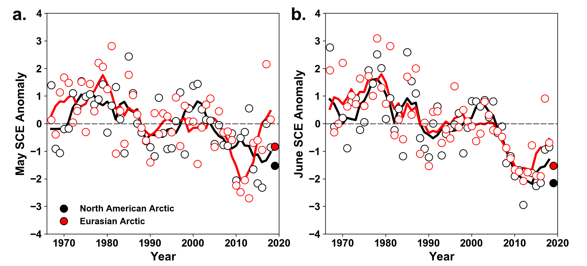
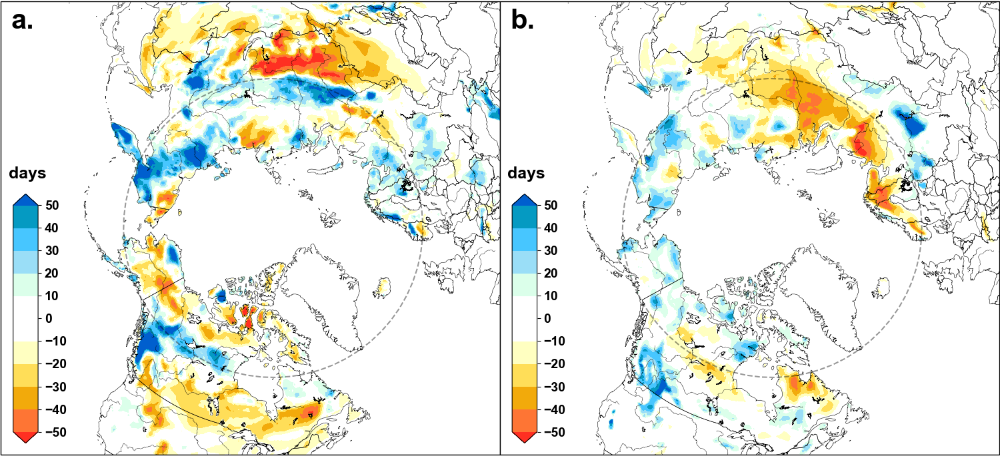

# Figures for Arctic Report Card

## **Things to note:** 
* **Data is fake, so we must check using real data at some point**
* **Please check that the map-figure colorbars make sense and are accurately representing the data**
* **Remember to remove the dummy-data manipulation for the map-figures [here](https://github.com/m9brady/arctic-report-card/blob/bd53d02bb4b7ce6fb28188a4b2c3509236ed66f2/scripts/snow_fig_2.py#L41-L43) and [here](https://github.com/m9brady/arctic-report-card/blob/bd53d02bb4b7ce6fb28188a4b2c3509236ed66f2/scripts/snow_fig_3.py#L47-L48)**

## **Environment Setup**

First, download and install [Miniconda](https://docs.conda.io/en/latest/miniconda.html) if you don't already have it.

### Windows users
```
> conda env create -f environment.yml
> conda activate py3-arc
(py3-arc) > python <path-to-script.py>
```
### Mac/Linux users
```
## Not an exact replica environment, but should work fine
## may also need to install fonts: sudo apt install ttf-mscorefonts-installer
$ conda create -n py3-arc python=3.7 scipy=1.4 requests=2 matplotlib=3 gdal=2 geopandas cartopy xarray
$ conda activate py3-arc
(py3-arc) $ python <path-to-script.py>
```

### Figure 1


### Figure 2


### Figure 3


### Figure 4

